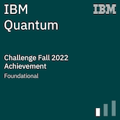

<!-- 

 -->
<h1>__</h1>

<h3 align="center">Hi there 👋
, I'm Rahul Dev Sharma</h3>
<h3 align="center">A Junior Undergraduate Physics student, who love to solve problems and open to new ideas to implement. </h3> <!--I'm interested in making my SECOND BRAIN using programming.</h4> -->
<h3>Passionate About:</h3>
<ul>
<li><em>Quantum Computation</em></li>
<li><em>Machine Learning</em></li>
<!--li><em>Machine learning and Data Science</em></li-->
<li><em>Competitive Programming</em></li>
<li><em>Astrophysics</em></li>
<li><em>Brain Computer Interfacing</em></li>
</ul>

<h3>I’m currently</h3>

- 🔭 working on BDLensing Astronomy Research Project, Omdena Local Chapter project.

- 🌱 learning Quantum Fourier Transform.

- 👯 looking to collaborate on Quantum Computing project, Python Project.

- 🤔 looking for help with Quantum Fourier Transform, Natural Language Processing, Transformers.
<!-- - 💬 Ask me about 
- ⚡ Fun fact: ... -->

<h3>Reach me on:</h3>

<h3>Languages &amp; Tools:</h3>

    <!--a href="https://github.com/rahulsust?tab=repositories" target="_blank"></a-->
    
    
    
    <!--a href="https://github.com/rahulsust?tab=repositories&language=js" target="_blank"></a-->
    <!--a href="https://github.com/rahulsust?tab=repositories&language=matlab" target="_blank"></a-->
    
    
    

 
<h3> Github Statistics: </h3>

    

<!--
-->
<!-- <h3> Achievements: </h3>

 -->
<!--

<!--  -->

<h3> Holopin Board:</h3>

    
    <a href="https://github.com/rahulsust" target="_blank"><!--..https://badges.pufler.dev/visits/rahulsust/rahulsust?logo=GitHub&label=visits&color=success&logoColor=white&style=flat-square"/></a-->
    <!---->
    

<h1>__</h1>
<!--

- 🔭 I’m currently working on ...
- 🌱 I’m currently learning ...
- 👯 I’m looking to collaborate on ...
- 🤔 I’m looking for help with ...
- 💬 Ask me about ...
- 📫 How to reach me: ...
- 😄 Pronouns: ...
- ⚡ Fun fact: ...
-->
